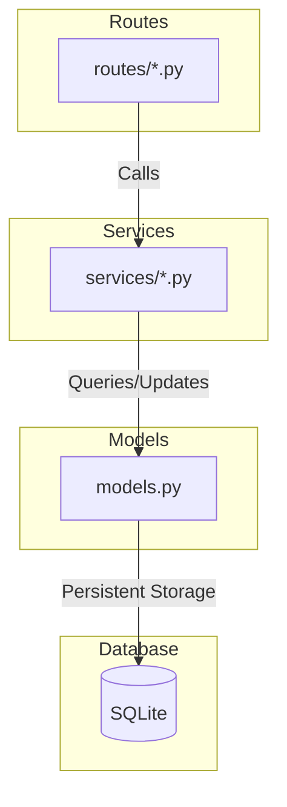

# Mixtape Architecture

Mixtape follows a strict layered architecture to ensure separation of concerns and maintainability.

## Core Flow: Route -> Service -> Model

### Layer Responsibilities

- **Routes**: Handle HTTP requests, parse arguments, and format JSON responses. They delegate all business logic to the service layer.
- **Services (The Logic Jungle)**: Contain the core business logic. They are governed by the **Docstring Contract**.
- **Models (The Cave)**: Define the database schema and relationships using SQLAlchemy.

### Data Layer Entities

- **User**: Represents a registered user, including their current listening streak and last activity timestamp.
- **Song**: Metadata for tracks shared within the app.
- **ListeningEvent**: A record of a user listening to a specific song at a specific time.
- **Playlist**: A collection of songs, possibly collaborative.
- **playlist_entries**: An association table for songs in playlists, including their `position`.
- **Notification**: Alerts for users when friends interact with their shared content.
