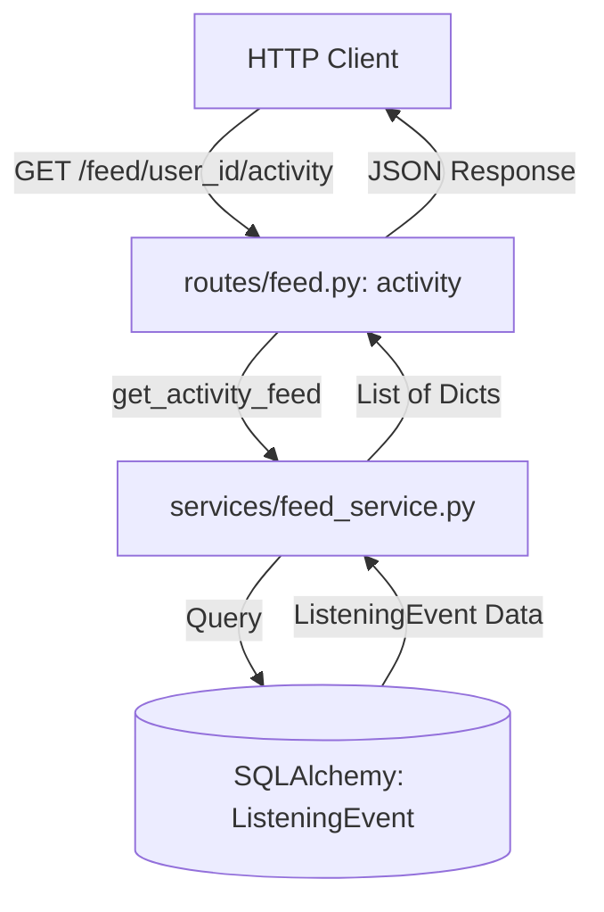
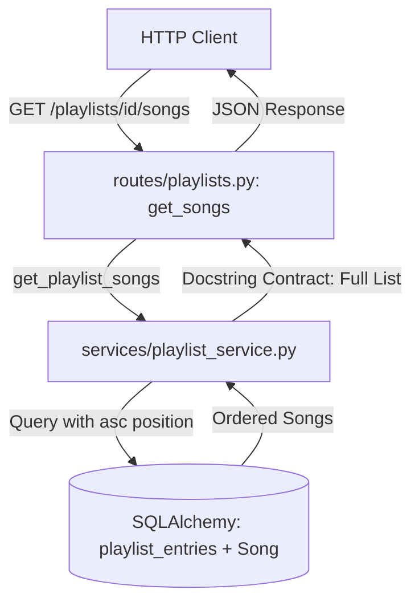

# Mixtape Architecture

This document describes the architectural flow and data patterns of the Mixtape application.

## Core Flow: Route -> Service -> Model

Mixtape follows a strict layered architecture where routes handle HTTP concerns, services encapsulate business logic (the "Logic Jungle"), and models represent the data layer (the "Cave").

### Activity Feed Flow
The activity feed displays recent listening events from friends.

### Playlist Ordering Flow
Playlists maintain an ordered collection of songs using a join table with a `position` column.

## Docstring Contract
The Service layer is bound by the **Docstring Contract**. The implementation must satisfy the behavior promised in the docstrings. Any deviation (e.g., returning fewer items than exists or returning duplicates when uniqueness is implied) constitutes a bug.

## Data Layer
- **User**: Stores profile and streak information (`listening_streak`, `last_listened_at`).
- **Song**: Metadata for tracks.
- **ListeningEvent**: Records each time a user listens to a song.
- **Playlist**: Collaborative collections of songs.
- **playlist_entries**: Join table linking Songs to Playlists with an explicit `position` for ordering.
